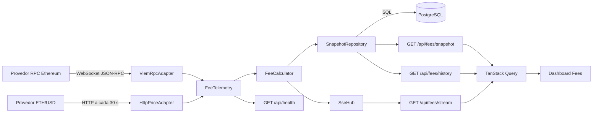

# Arquitetura do MVP

## 1. Objetivo e escopo

O sistema monitora taxas da rede Ethereum, transforma dados brutos em métricas
operacionais e estima custos em USD para perfis de transação. O painel deve
mostrar novos dados sem recarregar a página.

O MVP é somente leitura. Não assina nem envia transações, não implanta contratos
e não substitui a plataforma da Alphractal em produção.

## 2. Visão geral

A solução será um **monólito modular em Next.js**. Frontend, endpoints HTTP/SSE e
ingestão serão mantidos no mesmo repositório e executados no mesmo processo
Node.js. A separação é feita por módulos e interfaces, não por processos de rede.



## 3. Fluxo de dados

1. O processo Node.js inicia o módulo `FeeTelemetry`.
2. `ViemRpcAdapter` abre uma conexão WebSocket autenticada com o provedor RPC.
3. O adapter observa novos blocos e, quando disponível, transações pendentes.
4. `HttpPriceAdapter` consulta ETH/USD por HTTP a cada 30 segundos.
5. `FeeCalculator` combina taxas, atividade observada e preço em um
   `FeeSnapshot`.
6. `SnapshotRepository` persiste o snapshot consolidado no PostgreSQL.
7. `SseHub` envia o snapshot aos navegadores conectados.
8. O hook de SSE do frontend valida o evento e usa `queryClient.setQueryData`.
9. React renderiza novamente apenas os elementos afetados.

Não existe uma conexão WebSocket entre navegador e servidor. O WebSocket fica
restrito ao caminho servidor -> blockchain. A entrega servidor -> navegador é
unidirecional e usa SSE.

## 4. Módulo principal e interface

`FeeTelemetry` concentra ciclo de vida, reconexão, agregação, cálculo,
deduplicação, histórico e distribuição. Chamadores e testes atravessam a mesma
interface:

```ts
export interface FeeTelemetry {
  start(): Promise<void>
  stop(): Promise<void>
  getSnapshot(): FeeSnapshot | null
  getHealth(): TelemetryHealth
  subscribe(listener: (snapshot: FeeSnapshot) => void): () => void
}
```

As dependências externas são recebidas pelo módulo, em vez de serem criadas
dentro dele:

```ts
export type FeeTelemetryDependencies = {
  rpc: EthereumTelemetrySource
  price: EthUsdPriceSource
  snapshots: SnapshotRepository
  clock: Clock
}
```

O repositório expõe uma interface pequena e assíncrona:

```ts
export interface SnapshotRepository {
  save(snapshot: FeeSnapshot): Promise<void>
  getLatest(chainId: number): Promise<FeeSnapshot | null>
  getHistory(query: {
    chainId: number
    from?: Date
    to?: Date
    limit: number
  }): Promise<readonly FeeSnapshot[]>
}
```

Isso cria seams testáveis para RPC, preço e persistência. Produção usa
`PostgresSnapshotAdapter`; testes usam adapters determinísticos em memória. O
domínio não conhece SQL, driver ou formato de armazenamento.

## 5. Responsabilidades dos módulos

| Módulo | Responsabilidade |
| --- | --- |
| `FeeTelemetry` | Orquestrar fontes, cálculo, armazenamento e publicação |
| `ViemRpcAdapter` | WebSocket RPC, assinatura de blocos, mempool e reconexão |
| `HttpPriceAdapter` | Polling HTTP, timeout, validação e último preço válido |
| `FeeCalculator` | Cálculo puro de percentis, custo e congestionamento |
| `SnapshotRepository` | Interface de persistência de snapshot e histórico |
| `PostgresSnapshotAdapter` | Implementação SQL da interface em uma única tabela |
| `SseHub` | Fan-out dos eventos e remoção de assinantes desconectados |
| Route Handlers | Adaptar HTTP/SSE para a interface de `FeeTelemetry` |
| Hooks do frontend | Carregar estado inicial e aplicar eventos ao cache local |

## 6. Fontes de dados

### 6.1 Ethereum

O cliente público do Viem usa `webSocket(ETHEREUM_WS_RPC_URL)`. O fluxo de blocos
é baseado em `watchBlocks`, com início imediato e recuperação de blocos perdidos
quando suportado.

Dados mínimos por snapshot:

- número, hash e timestamp do bloco;
- `baseFeePerGas`;
- faixas de prioridade lenta, padrão e rápida;
- proporção de gás usado no bloco;
- quantidade observada de hashes pendentes por segundo;
- estado da conexão e instante do último evento.

O stream `newPendingTransactions` representa a visão do nó/provedor, não o
tamanho total e global da mempool. Por isso, o painel deve nomear a métrica como
**taxa observada de transações pendentes**.

Não se deve buscar os detalhes de todas as transações pendentes. Para o MVP, o
servidor conta hashes em janelas de um segundo. Uma amostragem limitada pode ser
adicionada posteriormente se for necessária para outra métrica.

### 6.2 ETH/USD

O adapter HTTP consulta inicialmente o endpoint `simple/price` do CoinGecko com:

```text
ids=ethereum
vs_currencies=usd
include_last_updated_at=true
```

Política inicial:

- intervalo: 30 segundos;
- timeout: 5 segundos;
- uma nova tentativa com pequeno atraso;
- manter o último preço válido após falha temporária;
- marcar o preço como degradado após 2 minutos sem atualização válida;
- nunca expor a chave do provedor ao navegador.

O adapter valida a resposta com Zod antes de atualizar o estado.

## 7. Contrato de dados

```ts
export type FeeSnapshot = {
  sequence: number
  timestamp: string
  chainId: number
  blockNumber: string
  blockHash: `0x${string}`

  baseFeeGwei: number
  gasUsedRatio: number

  priorityFeeGwei: {
    slow: number
    standard: number
    fast: number
  }

  ethUsd: number
  priceUpdatedAt: string
  priceStatus: 'fresh' | 'stale'

  pendingTransactionsPerSecond: number | null
  congestionLevel: 'low' | 'normal' | 'high' | 'critical'

  estimatedCosts: Array<{
    operation: string
    gasUnits: number
    slowUsd: number
    standardUsd: number
    fastUsd: number
  }>
}
```

`chainId` identifica a rede sem exigir uma tabela de redes. `blockNumber` é uma
string porque `bigint` não é serializado por JSON. Valores
on-chain permanecem como `bigint` durante o cálculo e são formatados apenas na
saída.

`sequence` é crescente por processo e permite que o frontend descarte eventos
duplicados ou fora de ordem.

## 8. Cálculos

As faixas iniciais usam percentis em vez de somente média, reduzindo o impacto de
valores extremos:

- lenta: p25;
- padrão: p50;
- rápida: p90.

Para uma taxa expressa em Gwei:

```text
custo em USD = gasUnits x (baseFeeGwei + priorityFeeGwei) x 10^-9 x ethUsd
```

Os perfis de operação devem ser configuráveis. Exemplos iniciais podem incluir
transferência de ETH, transferência ERC-20 e swap, mas os valores de `gasUnits`
precisam ser validados com o parceiro antes de serem apresentados como estimativas
institucionais.

`congestionLevel` deve ser uma função pura e testada, combinando ao menos taxa de
pendentes observada, `gasUsedRatio` e variação recente da taxa padrão. Os limiares
ficam centralizados em configuração.

## 9. Endpoints

### `GET /api/fees/snapshot`

Retorna o snapshot atual. É usado na abertura do painel, após reconexão e como
fallback quando o stream estiver indisponível.

### `GET /api/fees/history`

Consulta a janela persistida no PostgreSQL. Aceita limites e intervalo de tempo
validados; a resposta aplica `HISTORY_MAX_POINTS` para evitar consultas e
payloads sem limite.

### `GET /api/fees/stream`

Mantém uma resposta SSE aberta. Eventos previstos:

```text
event: snapshot
id: 152
data: {"sequence":152,"blockNumber":"..."}

event: health
data: {"rpcConnected":true,"priceStatus":"fresh"}
```

Requisitos do stream:

- `Content-Type: text/event-stream; charset=utf-8`;
- `Cache-Control: no-cache, no-transform`;
- `X-Accel-Buffering: no` quando houver proxy compatível;
- heartbeat em comentário (`: keep-alive`) a cada 15 segundos;
- `retry: 3000` para orientar a reconexão do navegador;
- enviar o snapshot atual logo após conectar;
- remover o assinante quando `request.signal` for abortado.

### `GET /api/health`

Expõe somente diagnóstico não sensível:

```ts
export type TelemetryHealth = {
  status: 'healthy' | 'degraded' | 'unhealthy'
  rpcConnected: boolean
  lastBlock: string | null
  lastBlockAt: string | null
  priceUpdatedAt: string | null
  priceStatus: 'fresh' | 'stale' | 'unavailable'
  sseClients: number
}
```

## 10. Atualização do dashboard

O estado inicial usa TanStack Query:

```ts
useQuery({
  queryKey: ['fees', 'snapshot'],
  queryFn: fetchFeeSnapshot,
  staleTime: 30_000,
})
```

O hook de stream abre `EventSource('/api/fees/stream')`. Quando recebe um snapshot
completo, atualiza diretamente o cache:

```ts
eventSource.addEventListener('snapshot', (event) => {
  const snapshot = FeeSnapshotSchema.parse(JSON.parse(event.data))

  queryClient.setQueryData(['fees', 'snapshot'], (current?: FeeSnapshot) => {
    if (current && current.sequence >= snapshot.sequence) return current
    return snapshot
  })
})
```

Não se usa `invalidateQueries` a cada evento completo, pois isso causaria uma nova
requisição HTTP desnecessária. A invalidação é adequada após uma reconexão ou
quando o SSE carregar apenas uma notificação sem os dados.

O dashboard apresenta explicitamente:

- conectado, reconectando, degradado ou offline;
- instante da última atualização;
- preço ETH/USD e sua idade;
- cards de taxa lenta, padrão e rápida;
- custo estimado por perfil de operação;
- série recente de taxa e congestionamento.

## 11. Inicialização e ciclo de vida

`src/instrumentation.ts` importa o bootstrap apenas no runtime Node.js. O bootstrap
é idempotente e retorna rapidamente após registrar os listeners; ele não aguarda
indefinidamente o stream.

Durante desenvolvimento, um símbolo em `globalThis` impede que hot reload abra
conexões duplicadas. Em produção, a premissa é uma instância Node.js e uma conexão
RPC.

O encerramento gracioso chama as funções retornadas pelo Viem, interrompe o
polling de preço e fecha os streams SSE.

## 12. Resiliência

- reconexão WebSocket com atraso crescente e limite observável;
- keep-alive fornecido pelo transporte do Viem;
- deduplicação por número e hash do bloco;
- substituição do último bloco quando houver reorganização;
- último preço válido preservado durante falha temporária;
- status degradado quando RPC ou preço estiverem atrasados;
- escrita idempotente e consulta paginada para limitar uso do PostgreSQL;
- heartbeat SSE e limpeza de conexões fechadas;
- logs estruturados sem URLs completas, chaves ou payloads sensíveis.

## 13. Implantação e limites de escala

O MVP deve rodar em um servidor Node.js persistente, preferencialmente em um
container, com uma única réplica. O ambiente precisa suportar respostas em
streaming sem buffering intermediário.

Premissas do MVP:

```text
1 container
1 processo Next.js
1 instância de FeeTelemetry
1 WebSocket RPC
N conexões SSE
```

Se o sistema passar a usar múltiplas réplicas, cada processo teria seu próprio
WebSocket e conjunto de clientes, embora compartilhe o histórico no PostgreSQL.
Nesse momento, a ingestão deve ser
extraída para um worker persistente ou coordenada por um mecanismo compartilhado,
como Redis/PubSub. Essa infraestrutura não faz parte do MVP.

## 14. Persistência e banco de dados

O PostgreSQL é a única base persistente da aplicação. Ele preserva o histórico
entre reinícios, permite filtrar períodos e facilita agregações temporais com
SQL. MongoDB não será usado porque os snapshots têm contrato estável, relações
simples e consultas previsíveis por rede e tempo.

### 14.1 Modelo mínimo

Uma tabela é suficiente. Perfis de operação e limites de congestionamento ficam
versionados no código; não exigem tabelas próprias. Os custos estimados são
gravados em `jsonb` porque são um resultado autocontido do snapshot e não
precisam de joins.

```sql
CREATE TABLE fee_snapshots (
  id bigint GENERATED ALWAYS AS IDENTITY PRIMARY KEY,
  observed_at timestamptz NOT NULL,
  chain_id bigint NOT NULL,
  block_number bigint NOT NULL,
  block_hash varchar(66) NOT NULL,
  base_fee_gwei numeric(20, 9) NOT NULL,
  slow_fee_gwei numeric(20, 9) NOT NULL,
  standard_fee_gwei numeric(20, 9) NOT NULL,
  fast_fee_gwei numeric(20, 9) NOT NULL,
  eth_usd numeric(20, 8) NOT NULL,
  pending_tx_per_second numeric(20, 4),
  gas_used_ratio numeric(10, 6) NOT NULL,
  congestion_level text NOT NULL CHECK (
    congestion_level IN ('low', 'normal', 'high', 'critical')
  ),
  estimated_costs jsonb NOT NULL DEFAULT '[]'::jsonb,
  extra jsonb NOT NULL DEFAULT '{}'::jsonb,
  UNIQUE (chain_id, block_hash)
);

CREATE INDEX fee_snapshots_chain_time_idx
  ON fee_snapshots (chain_id, observed_at DESC);
```

A restrição única torna a gravação idempotente quando o provedor reenviar o
mesmo bloco. Reorganizações são identificadas por `chain_id`, `block_number` e
`block_hash`; o snapshot canônico mais recente é determinado pelo estado
observado pelo `FeeTelemetry`.

### 14.2 Política de gravação e retenção

- persistir um snapshot consolidado por novo bloco;
- manter atualizações de mempool entre blocos somente no estado vivo e no SSE;
- usar transação curta e parâmetros SQL, nunca interpolação de strings;
- limitar toda consulta de histórico;
- definir retenção por configuração e executar a limpeza em um job simples;
- manter o último snapshot em memória para fan-out SSE e resposta imediata,
  usando o PostgreSQL como fonte durável do histórico.

### 14.3 Sem autenticação de usuários

O dashboard é somente leitura e não mantém contas, preferências ou dados
pessoais. Portanto, não existem tabelas de usuários, sessões, organizações ou
permissões. A ausência de autenticação de usuários não significa expor o banco:

- apenas o backend acessa o PostgreSQL pela variável `DATABASE_URL`;
- o banco não é acessível diretamente pelo navegador;
- a credencial usa um usuário de aplicação com permissões mínimas;
- endpoints de telemetria aplicam validação, limites e rate limiting no proxy;
- segredos não recebem o prefixo `NEXT_PUBLIC_`.

## 15. Segurança

- chaves RPC e de preço ficam apenas em variáveis de ambiente do servidor;
- `DATABASE_URL` fica apenas no runtime do servidor;
- o usuário do PostgreSQL recebe somente as permissões necessárias;
- nenhuma chave recebe o prefixo `NEXT_PUBLIC_`;
- o código não contém carteira, chave privada ou método de envio de transação;
- respostas e logs não incluem a URL RPC autenticada;
- dados externos são validados em runtime;
- endpoints públicos retornam somente dados de telemetria necessários ao painel.

## 16. Stack e dependências

Dependências de execução:

| Pacote | Uso |
| --- | --- |
| `next`, `react`, `react-dom` | Aplicação, renderização e Route Handlers |
| `viem` | Cliente Ethereum e transporte WebSocket JSON-RPC |
| `@tanstack/react-query` | Estado remoto e cache no navegador |
| `zod` | Validação de ambiente, preço HTTP e eventos SSE |
| `postgres` | Driver PostgreSQL e consultas SQL parametrizadas |
| `recharts` | Gráficos responsivos do dashboard |
| `tailwindcss` | Layout e identidade visual |

Ferramentas de teste previstas:

- `vitest` para cálculos, schemas, store e telemetria;
- `@testing-library/react` e `@testing-library/jest-dom` para o frontend;
- `msw` para simular a fonte HTTP de preço;
- `@playwright/test` para o fluxo completo no navegador.

Não são necessárias dependências para Socket.IO, WebSocket manual, Axios,
Express, ORM, MongoDB ou autenticação de usuários no MVP. Migrações são arquivos
SQL versionados e executados pelo comando de migração do projeto.

## 17. Gestão do trabalho

Atividades, prioridades, responsáveis e status serão mantidos exclusivamente no
Kanban do projeto, sem duplicação em um documento de planejamento.

## 18. Referências

- [Next.js - Route Handlers](https://nextjs.org/docs/app/getting-started/route-handlers)
- [Next.js - Instrumentation](https://nextjs.org/docs/app/guides/instrumentation)
- [Next.js - Self-hosting e streaming](https://nextjs.org/docs/app/guides/self-hosting)
- [Viem - WebSocket transport](https://viem.sh/docs/clients/transports/websocket)
- [Viem - watchBlocks](https://viem.sh/docs/actions/public/watchBlocks)
- [TanStack Query - QueryClient](https://tanstack.com/query/latest/docs/reference/QueryClient)
- [MDN - Server-sent events](https://developer.mozilla.org/docs/Web/API/Server-sent_events/Using_server-sent_events)
- [CoinGecko - Simple Price](https://docs.coingecko.com/reference/simple-price)
