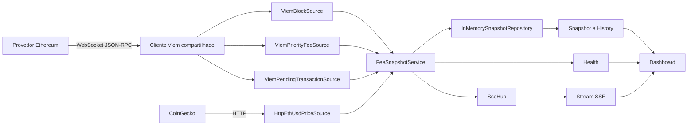

# Arquitetura do Blockas

## 1. Visão geral

O sistema é um monólito modular em Next.js executado em um processo Node.js
persistente. O backend transforma telemetria Ethereum em snapshots prontos para
o dashboard e mantém apenas uma janela recente em memória.



Não existe WebSocket entre navegador e backend. O navegador usa HTTP para o
estado inicial e SSE para atualizações.

## 2. Fluxo de dados

1. `src/instrumentation.ts` inicia o runtime somente no ambiente Node.js.
2. O runtime cria um único `PublicClient` Viem com transporte WebSocket.
3. O mesmo cliente observa blocos, consulta `eth_feeHistory` e observa hashes
   de transações pendentes.
4. A cotação ETH/USD é consultada por HTTP e reutilizada durante o intervalo
   configurado.
5. Cada novo bloco produz um `FeeSnapshot` consolidado.
6. O snapshot é salvo no histórico circular em memória.
7. O `SseHub` publica o snapshot e a saúde atual aos navegadores conectados.

## 3. Componentes

| Componente | Responsabilidade |
| --- | --- |
| `FeeSnapshotService` | Orquestrar telemetria, preço, cálculos, store e SSE |
| `ViemBlockSource` | Observar blocos e reportar conexão RPC |
| `ViemPriorityFeeSource` | Consultar p25, p50 e p90 de prioridade |
| `ViemPendingTransactionSource` | Observar hashes pendentes em lotes |
| `HttpEthUsdPriceSource` | Timeout, retry, cache e timestamp do preço |
| `InMemorySnapshotRepository` | Snapshot atual, histórico limitado e reorganizações |
| `SseHub` | Snapshot inicial, health, retry, heartbeat e fan-out |
| Route Handlers | Expor as interfaces HTTP e SSE |

## 4. Configuração

| Variável | Uso | Padrão |
| --- | --- | --- |
| `ETHEREUM_WS_RPC_URL` | Endpoint WebSocket Ethereum | obrigatória |
| `ETH_USD_API_URL` | Endpoint HTTP ETH/USD | CoinGecko `simple/price` |
| `ETH_USD_POLL_INTERVAL_MS` | Tempo mínimo entre consultas de preço | `30000` |
| `HISTORY_MAX_POINTS` | Capacidade do histórico circular | `500` |

Credenciais ficam somente no servidor e nunca usam o prefixo `NEXT_PUBLIC_`.

## 5. Contrato de snapshot

```ts
export type FeeSnapshot = {
  sequence: number
  timestamp: string
  chainId: number
  blockNumber: string
  blockHash: `0x${string}`
  baseFeeGwei: number
  gasUsedRatio: number
  priorityFeeGwei: {
    slow: number
    standard: number
    fast: number
  }
  ethUsd: number
  priceUpdatedAt: string
  priceStatus: 'fresh' | 'stale'
  pendingTransactionsPerSecond: number | null
  congestionLevel: 'low' | 'normal' | 'high' | 'critical'
  estimatedCosts: Array<{
    operation: string
    gasUnits: number
    slowUsd: number
    standardUsd: number
    fastUsd: number
  }>
}
```

`blockNumber` é uma string porque `bigint` não é serializado por JSON.
`sequence` cresce por processo e permite que o frontend descarte eventos antigos.

## 6. Cálculos

As faixas de prioridade são obtidas de `eth_feeHistory`:

- lenta: p25;
- padrão: p50;
- rápida: p90.

O custo estimado usa:

```text
gasUnits × (baseFeeGwei + priorityFeeGwei) × 10^-9 × ethUsd
```

O congestionamento considera o maior nível indicado por:

- proporção de gás utilizado;
- hashes pendentes observados no último segundo;
- crescimento recente da taxa padrão.

## 7. ETH/USD

O adapter consulta `ids=ethereum`, `vs_currencies=usd` e
`include_last_updated_at=true`. A política padrão é:

- timeout de 5 segundos;
- até duas novas tentativas com atraso curto;
- intervalo mínimo de 30 segundos entre consultas;
- último preço válido como fallback;
- preço `stale` depois de 2 minutos sem atualização válida.

## 8. Estado em memória

O `InMemorySnapshotRepository` mantém:

- o snapshot mais recente por rede;
- histórico circular limitado por `HISTORY_MAX_POINTS`;
- deduplicação por rede e hash;
- substituição quando a mesma altura chega com um novo hash.

O histórico é perdido quando o processo reinicia. Isso é comportamento esperado
para este projeto e não exige banco de dados.

## 9. Endpoints

### `GET /api/fees/snapshot`

Retorna o snapshot atual. Antes do primeiro bloco, retorna `503` com o envelope
de erro compartilhado.

```json
{
  "sequence": 12,
  "blockNumber": "20500000",
  "baseFeeGwei": 8.42,
  "priorityFeeGwei": { "slow": 1, "standard": 2, "fast": 4 },
  "ethUsd": 3100,
  "priceStatus": "fresh",
  "pendingTransactionsPerSecond": 24,
  "congestionLevel": "normal",
  "estimatedCosts": []
}
```

O exemplo está abreviado; a resposta real segue integralmente
`FeeSnapshotSchema`.

### `GET /api/fees/history`

Aceita:

- `limit`: inteiro positivo, limitado a 500;
- `from`: data válida;
- `to`: data válida e não anterior a `from`.

Retorna um array de `FeeSnapshot`. Parâmetros inválidos retornam `400`.

### `GET /api/health`

```json
{
  "status": "healthy",
  "rpcConnected": true,
  "lastBlock": "20500000",
  "lastBlockAt": "2026-08-24T10:00:00.000Z",
  "priceUpdatedAt": "2026-08-24T09:59:50.000Z",
  "priceStatus": "fresh",
  "sseClients": 2
}
```

### `GET /api/fees/stream`

```text
retry: 3000

event: snapshot
id: 12
data: {"sequence":12,"blockNumber":"20500000"}

event: health
data: {"status":"healthy","rpcConnected":true}
```

O stream envia `: keep-alive` a cada 15 segundos e remove o cliente quando a
requisição é encerrada.

## 10. Integração do frontend

O frontend deve:

1. carregar `/api/fees/snapshot` e `/api/fees/history` por HTTP;
2. abrir `EventSource('/api/fees/stream')`;
3. validar eventos com os schemas de `src/modules/fees`;
4. aplicar snapshots novos ao cache do TanStack Query com `setQueryData`;
5. exibir o estado de `/api/health` e dos eventos `health`;
6. refazer o carregamento HTTP depois de uma reconexão SSE.

## 11. Ciclo de vida e resiliência

- o bootstrap é idempotente durante hot reload;
- o Viem mantém keep-alive e reconexão WebSocket;
- o runtime observa `SIGTERM` e `SIGINT`;
- o encerramento remove as assinaturas, fecha o WebSocket e encerra clientes SSE;
- falhas externas são reportadas por health e não expõem a URL RPC.

## 12. Testes

Os testes usam fontes falsas de bloco, prioridade, mempool, preço e relógio. Há
cobertura do fluxo bloco → snapshot → histórico → SSE, reorganização, preço
stale, health, filtros HTTP e encerramento do stream.

```bash
npm ci
npm run lint
npm run typecheck
npm test
npm run build
```

## 13. Limites operacionais

- uma instância Node.js;
- um processo Next.js;
- um cliente WebSocket Ethereum compartilhado;
- histórico somente em memória;
- disponibilidade de mempool dependente do provedor RPC;
- aplicação somente leitura, sem contas ou autenticação de usuários.
